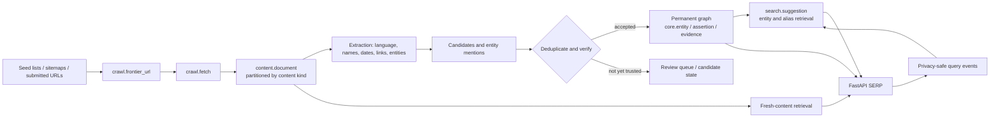

# Khojo database core plan

## Decision

Khojo's first durable asset is not a collection of crawled pages. It is a
provenance-backed, bilingual graph of Bangladesh: canonical entities, their
names, locations, relationships, claims, and sources. Crawled pages are
evidence and search inventory around that graph. They may expire; the verified
knowledge they support must not disappear with them.

The implementation for this decision is
[backend/sql/0001_khojo_core.sql](../../backend/sql/0001_khojo_core.sql). It is
written for PostgreSQL 16 and intentionally uses only PostgreSQL FTS,
`pg_trgm`, JSONB, and normal relational joins. It does not require a graph
database, Elasticsearch, Redis, or pgvector to launch.

## The two data layers

| Layer | Schemas | What belongs here | Lifetime | Search role |
| --- | --- | --- | --- | --- |
| Permanent knowledge graph | `core`, `search`, `media` | entities, Bangla/English/Banglish names, places, source registry, assertions, evidence, suggestions, media URLs | retained and versioned | entity lookup, autocomplete, local intent, knowledge cards |
| Temporary discovery and content | `crawl`, `content` | URL frontier, fetch attempts, extracted documents, entity mentions, query events | retention-controlled | fresh news and web results; feeds graph candidates |

The boundary is deliberate: a page can be deleted, blocked, or become stale
without deleting a school, union, business, person, place, or historical claim
already corroborated by other sources.

## Bangladesh common-ground coverage

“Every single thing that can exist in Bangladesh” cannot be a finite,
trustworthy list. New businesses, events, pages, products, and local names are
created every day; some data is private or should never be collected. The
correct promise is an **open taxonomy with an `thing` root**: every permitted
item has a place in the graph today, and an editor can add a subtype tomorrow
without changing the database schema.

The supplied seed taxonomy covers the common ground:

- geography: country, administrative area, settlement, neighbourhood, address,
  postal area, land or water feature, route, transport stop;
- people and groups: person, public figure, household or community group;
- institutions and commerce: government body, school, university, hospital,
  NGO, company, cooperative, business, branch, brand, marketplace;
- economy: product, service, job, price offer, agricultural item, financial
  instrument, tender, licence, programme;
- civic record: law, regulation, public service, election, project, statistic,
  dataset, emergency notice;
- culture and information: language term, topic, book, article, report, web
  page, image, video, audio, creative work, publisher;
- time and activity: event, observance, sports fixture, training, campaign,
  alert; and
- physical world: facility, utility, infrastructure, natural feature,
  environment observation.

The official geography hierarchy is represented as `place` entities with
parent links, so it can hold country → division → district → upazila → union or
pourashava → ward → village or mohalla, plus non-administrative places such as
markets, rivers, bus stops, and service areas. Do not hard-code counts or names
in application code; import authoritative records and retain their source and
effective date.

## Non-negotiable data rules

1. An entity is a real-world identity, not a URL. URLs and pages live in
   `core.source_record` and `content.document`.
2. Every public fact is an `assertion` with at least one evidence record before
   it is promoted to `verified`. The database permits an unverified candidate;
   the promotion job must reject unsourced facts.
3. Names are first-class. Keep native Bangla, English, Banglish, common
   misspellings, abbreviations, and source spellings as distinct aliases with a
   script and provenance.
4. Never make National ID, private phone numbers, precise home addresses,
   children’s data, credentials, or unconsented personal data part of the
   public index. The crawler and review workflow must enforce this.
5. A crawler never marks truth. It creates documents, mentions, candidates,
   and evidence. A deterministic verifier or a human can promote a claim.
6. A source is not automatically authoritative. `trust_tier` is a ranking
   input, not a claim of truth; it must be reviewed per source class.

## Data flow

## Mapping the current MVP

| Current table/model | Target | Migration treatment |
| --- | --- | --- |
| `documents` | `core.source_record` + `content.document` | re-ingest after URL canonicalisation and content hashing |
| `crawl_queue` | `crawl.frontier_url` + `crawl.fetch` | migrate URL state; do not trust old status as a fetch history |
| `transliteration_map` | `core.entity_name` / `core.entity_alias` and `search.suggestion` | attach to an entity when known; otherwise retain as a search term candidate |
| `autosuggestions` | `search.suggestion` | preserve priority, intent, source, and expiry policy |
| `SearchIndex` | delete from the application path after backfill | it contains a separate hard-coded database configuration and must not be the production model |

The existing FastAPI endpoints are useful prototypes, but their current
`ILIKE '%query%'` scan and mixing of pending crawl URLs into organic results
should be replaced after the backfill with typed, source-aware retrieval.

## Build and relaunch sequence

### 0. Decide and prepare

- Freeze a data policy: public-only scope, removal/contact channel, source
  licence notes, robots and rate-limit policy, retention defaults, and a named
  human reviewer for high-impact facts.
- Choose a small, useful launch slice: official Bangladesh geography plus 100–
  300 public sources and one crawl segment (`news` is the best first segment).
- Record the source owner, source type, access method, interval, and explicit
  crawl permission before adding any seed URL.

### 1. Provision the serving core

- Create the Hetzner VPS, attach the domain through Cloudflare, and permit only
  HTTP/HTTPS plus locked-down SSH. Install PostgreSQL 16, Nginx, the FastAPI
  service, a systemd unit, automated security updates, and daily encrypted
  database backups stored off-box.
- Create a least-privilege application role and a separate migration role.
  The database must never be exposed publicly. Crawler credentials must be
  distinct, TLS-only, IP-allowlisted, and revocable.
- Deploy the frontend as static Nginx files. The serving machine must not run
  crawl workers, Chromium, image processing, or large embedding jobs.

### 2. Establish the core before crawling

- Run the core migration in a disposable PostgreSQL 16 instance, then the VPS.
- Seed the taxonomy, relation vocabulary, Bangladesh geography, and a first
  source registry from authoritative files. Load names and aliases before pages
  so autocomplete works immediately.
- Replace the MVP's data access layer with a single SQLAlchemy/Alembic
  migration history; remove the duplicate `SearchIndex` database setup.

### 3. One vertical crawl, end to end

- Start with 10 approved sources and a conservative crawler: robots check,
  canonical URL normalisation, per-domain concurrency of 1, exponential retry,
  conditional requests, HTML size caps, and an identifiable Khojo user agent
  with a contact URL.
- Store page metadata and extracted text in `content`, raw bodies/screenshots
  only in object storage when genuinely needed, and media as Cloudflare object
  URLs. Write source records and document fingerprints idempotently.
- Extract candidates; do not silently create verified entities from a single
  page. Deduplicate by canonical URL, content hash, aliases, domain identity,
  and place context.

### 4. Deliver a truthful SERP

- Retrieve suggestions and entities first, then the selected fresh-content
  partitions. Use `pg_trgm` for Bangla/Banglish prefix/typo matching and simple
  FTS plus normalised text for documents. Add semantic/vector retrieval only
  after relevance measurements show the lexical baseline is insufficient.
- Render a knowledge card only when the graph has a verified entity and show
  source links, freshness, and an uncertainty state. A missing card is more
  trustworthy than a fabricated one.
- Replace the UI sketch's simulated index counter and “live” labels with real
  index statistics and query latency. Make Bangla the default writing path,
  retain English/Banglish input, and keep result verticals hidden until they
  have actual inventory.

### 5. Operate and scale

- Use GitHub Actions for short, segmented crawls and move long jobs to Oracle
  Free only after the first vertical is stable. The crawler writes finished,
  validated records over TLS; it never shares the serving deployment.
- Set database backup restore drills, retention cleanup, crawl error alerts,
  query latency dashboards, source health dashboards, and an abuse/removal
  workflow before opening access beyond testers.
- Scale only on observed triggers: add Redis after Tier-0 cache misses cause
  latency, partition or archive content before disk pressure, and add a read
  replica only when measurements show the serving database needs one.

## Verification gates

| Gate | Evidence required before the next stage |
| --- | --- |
| Schema | fresh PostgreSQL 16 install succeeds; constraints and indexes exist; migration is recorded |
| Taxonomy | every seed entity has a type, a preferred name, language/script, source, and (when applicable) a Bangladesh place |
| Graph | fixtures prove aliases resolve, `same_as` does not self-link, assertions obey the object constraint, and verified claims have evidence |
| Crawl | robots/rate-limit behaviour, URL canonicalisation, retry, hash dedupe, charset/Bangla extraction, and no duplicate document after a second run |
| Search | 100 hand-labelled Bangla, English, Banglish, spelling-variant, location, and freshness queries pass a recall/relevance review; no pending crawl URL appears as a result |
| Security | backup restore is rehearsed; crawler/service roles cannot administer the DB; secrets never enter Git; public endpoints have rate limits and logs redact query identifiers |
| Release | mobile Bengali SERP, source citations, no fake live metrics, p95 latency target, 404/500 monitoring, and a manual rollback exercise |

## Manual work that only the founder/team can do

- Own the domain, Cloudflare, Hetzner, R2, GitHub, and backup-storage accounts;
  create their billing, recovery, and access policies.
- Decide source permissions, contracts, public-interest boundaries, and which
  sensitive categories must be excluded. Obtain permission when a source
  requires it; robots.txt is a crawl signal, not a licence.
- Supply or approve authoritative seed files for geography, public bodies,
  services, and transliteration quality. Review the first alias and entity
  merge queue—this is product judgment, not a safe automatic decision.
- Test real Bangla, Banglish, and English queries with people in different
  regions and decide which failures deserve curated answers or new sources.
- Designate who handles removals, corrections, source complaints, and incident
  response before public launch.

## What comes next

The next implementation task is to convert the SQL into Alembic migrations,
write the target SQLAlchemy models and replacement search endpoint, then build
the schema-aware crawler against the contracts in this document. Do not run a
wide crawl against the MVP tables first: it creates data that is expensive to
deduplicate and difficult to attribute later.
